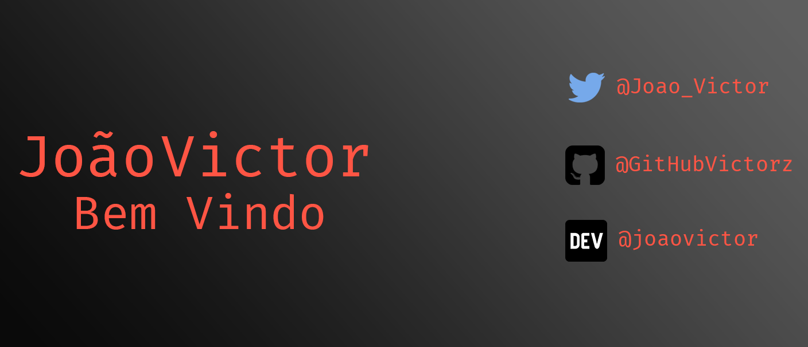

<h1 align="center">
	Bem Vindo ao Meu GitHub
</h1>

<h2 align="center">
	Linguagens e Tecnologias Usadas:
</h2>

	
	
	
	
	
	

<h3 align="center">
	Onde Pode Me Contrar:
</h3>

	
	 
	
	 
	
	 
	
	 

⭐️ From [JoãoVictor](https://github.com/GitHubVictorzz)
